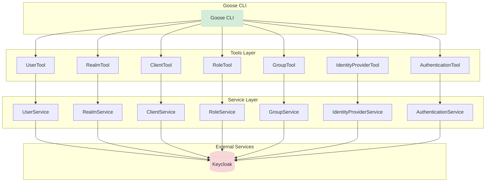

# Keycloak MCP Server Developer Guide
This guide provides detailed technical information for developers working on the Keycloak MCP Server project.

## Building from Source
1. Clone the repository:
   ```
   git clone https://github.com/yourusername/keycloak-mcp-server.git
   cd keycloak-mcp-server
   ```
2. Build the project:
   ```
   ./gradlew build
   ```

## GitHub Actions Builds
Keycloak MCP Server uses GitHub Actions to automatically build and test the project on every commit.

### Accessing Built Artifacts
1. Go to the Actions tab in the GitHub repository.
2. Click on the latest workflow run.
3. Scroll down to the "Artifacts" section to download the built artifacts.

### Releases
Official releases are created when changes are pushed to the main branch. You can find the latest release with all artifacts on the Releases page.

## Running the Application
The Keycloak MCP Server is built using Quarkus, which provides fast startup times and a low memory footprint.

### Prerequisites
- Java 21 or higher
- Gradle 8.0 or higher
- Keycloak server (for integration)

### Running in Development Mode
To run the application in development mode:
```bash
./gradlew quarkusDev
```

This enables hot deployment with background compilation, allowing you to make changes to the code and automatically reload the application.

### Configuration
The application can be configured using the `application.properties` file located in `src/main/resources/`. Key configuration properties include:

- `quarkus.keycloak.url`: The URL of the Keycloak server

An example docker-compose file is provided for local development.

## Testing
Keycloak MCP Server includes a comprehensive test suite to ensure code quality and prevent regressions.

### Running Tests
To run the tests locally:
```bash
./gradlew test
```

This will execute all tests and generate a report in `build/reports/tests/test/index.html`.

### Continuous Integration
The GitHub Actions workflow automatically runs all tests for:
- Every push to the main branch
- Every pull request targeting the main branch

This ensures that all code changes pass tests before being merged, maintaining code quality and preventing regressions.

## Project Architecture
Keycloak MCP Server is organized into several key packages:

- `dev.shaaf.keycloak.mcp.server.service`: Service classes that handle operations with Keycloak
- `dev.shaaf.keycloak.mcp.server.tools`: Tool classes that expose functionality through the MCP protocol

The project follows a layered architecture with tool classes that expose functionality through the MCP protocol and service classes that handle the actual operations with Keycloak.

### Class Structure
The project includes the following main components:

- **Service Layer**: Handles the actual operations with Keycloak
  - `UserService`: Manages user-related operations
  - `RealmService`: Manages realm-related operations
  - `ClientService`: Manages client-related operations
  - `RoleService`: Manages role-related operations
  - `GroupService`: Manages group-related operations
  - `IdentityProviderService`: Manages identity provider-related operations
  - `AuthenticationService`: Manages authentication flow-related operations

- **Tools Layer**: Exposes functionality through the MCP protocol
  - `UserTool`: Exposes user-related operations
  - `RealmTool`: Exposes realm-related operations
  - `ClientTool`: Exposes client-related operations
  - `RoleTool`: Exposes role-related operations
  - `GroupTool`: Exposes group-related operations
  - `IdentityProviderTool`: Exposes identity provider-related operations
  - `AuthenticationTool`: Exposes authentication flow-related operations


### Class Diagram

Below is a class diagram showing the structure of the tools package and its relationships with the service layer:




### Building via source and running locally

You can start a local Keycloak instance using Docker Compose:

```bash
docker-compose -f deploy/docker-compose.yml up
```

### Building the Application

To build the application using Gradle:

```bash
./gradlew build
```

To build an uber jar:

```bash
./gradlew quarkusBuild -Dquarkus.package.type=uber-jar
```

### Running with Goose

[Goose](https://github.com/goose-ai/goose) is a command-line interface for AI assistants. You can integrate and run this project as an extension with Goose:

```bash
goose session --with-extension="java -jar build/quarkus-app/quarkus-run.jar"
```

Or with the uber jar:

```bash
goose session --with-extension="java -jar build/keycloak-mcp-server-1.0.0-Alpha1-runner.jar"
```

## CI/CD with GitHub Actions

This project uses GitHub Actions for continuous integration and delivery. The following workflows are available:

### Build and Test

The Build and Test workflow runs automatically on push and pull requests to the main branch. It:
- Builds the project
- Runs all tests
- Uploads test results as artifacts

This workflow ignores changes to image files (jpg, jpeg, png, gif, svg), txt files, and markdown files.

### Build Artifacts

The Build Artifacts workflow runs automatically on push and pull requests to the main branch. It:
- Builds an uber-jar
- Builds native binaries for Linux, MacOS, and Windows using GraalVM
- Uploads all artifacts

This workflow ignores changes to image files (jpg, jpeg, png, gif, svg), txt files, and markdown files.

### Release

The Release workflow is triggered manually and allows you to create a new release. To create a release:
1. Go to the Actions tab in the GitHub repository
2. Select the "Release" workflow
3. Click "Run workflow"
4. Enter the release version (e.g., "1.0.0")
5. Select whether this is a pre-release
6. Click "Run workflow"

The workflow will:
- Build an uber-jar
- Build native binaries for Linux, MacOS, and Windows
- Create a GitHub release with all artifacts