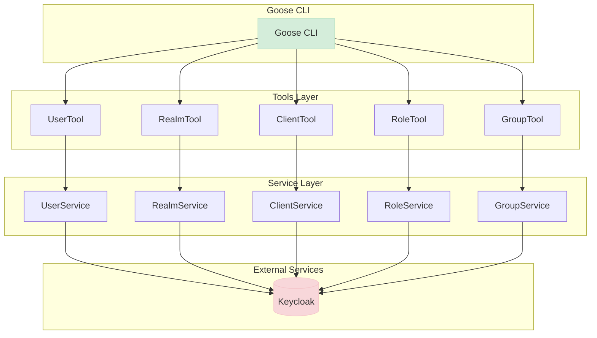

# Keycloak MCP Server Developer Guide
This guide provides detailed technical information for developers working on the Keycloak MCP Server project.

## Building from Source
1. Clone the repository:
   ```
   git clone https://github.com/yourusername/keycloak-mcp-server.git
   cd keycloak-mcp-server
   ```
2. Build the project:
   ```
   ./mvnw clean package
   ```

## GitHub Actions Builds
Keycloak MCP Server uses GitHub Actions to automatically build and test the project on every commit.

### Accessing Built Artifacts
1. Go to the Actions tab in the GitHub repository.
2. Click on the latest workflow run.
3. Scroll down to the "Artifacts" section to download the built artifacts.

### Releases
Official releases are created when changes are pushed to the main branch. You can find the latest release with all artifacts on the Releases page.

## Running the Application
The Keycloak MCP Server is built using Quarkus, which provides fast startup times and a low memory footprint.

### Prerequisites
- Java 21 or higher
- Maven 3.6 or higher
- Keycloak server (for integration)

### Running in Development Mode
To run the application in development mode:
```bash
./mvnw quarkus:dev
```

This enables hot deployment with background compilation, allowing you to make changes to the code and automatically reload the application.

### Configuration
The application can be configured using the `application.properties` file located in `src/main/resources/`. Key configuration properties include:

- `quarkus.keycloak.url`: The URL of the Keycloak server

An example docker-compose file is provided for local development.

## Testing
Keycloak MCP Server includes a comprehensive test suite to ensure code quality and prevent regressions.

### Running Tests
To run the tests locally:
```bash
./mvnw test
```

This will execute all tests and generate a report in `build/reports/tests/test/index.html`.

### Continuous Integration
The GitHub Actions workflow automatically runs all tests for:
- Every push to the main branch
- Every pull request targeting the main branch

This ensures that all code changes pass tests before being merged, maintaining code quality and preventing regressions.

## Project Architecture
Follows a layered architecture with tool classes that expose functionality through the MCP protocol and service classes that handle the actual operations with Keycloak.
Each tool class follows a similar pattern:
- Injects a corresponding service class that handles the actual operations with Keycloak
- Injects an ObjectMapper for JSON serialization/deserialization
- Exposes methods with @Tool annotations that delegate to the service class

### Class Structure
The project includes the following main components:

- **Service Layer**: Handles the actual operations with Keycloak
  - `UserService`: Manages user-related operations
  - `RealmService`: Manages realm-related operations
  - `ClientService`: Manages client-related operations
  - `RoleService`: Manages role-related operations
  - `GroupService`: Manages group-related operations
  - `IdentityProviderService`: Manages identity provider-related operations
  - `AuthenticationService`: Manages authentication flow-related operations

- **Tools Layer**: Exposes functionality through the MCP protocol
  - `UserTool`: Exposes user-related operations
  - `RealmTool`: Exposes realm-related operations
  - `ClientTool`: Exposes client-related operations
  - `RoleTool`: Exposes role-related operations
  - `GroupTool`: Exposes group-related operations
  - `IdentityProviderTool`: Exposes identity provider-related operations
  - `AuthenticationTool`: Exposes authentication flow-related operations

### Class Diagram

Below is a class diagram showing the structure of the tools package and its relationships with the service layer:


## Architecture

The project follows a layered architecture with tool classes that expose functionality through the MCP protocol and service classes that handle the actual operations with Keycloak.

### Tools Package Explanation

The tools package contains classes that expose Keycloak functionality through the MCP protocol:

1. **UserTool**: Manages Keycloak users, including creation, deletion, updating user information, and managing user roles and groups.

2. **RealmTool**: Manages Keycloak realms, including creation, deletion, updating realm settings, and managing realm events configuration.

3. **ClientTool**: Manages Keycloak clients, including creation, deletion, updating client settings, managing client secrets, and client roles.

4. **RoleTool**: Manages Keycloak roles, including creation, deletion, updating role settings, and managing role composites.

5. **GroupTool**: Manages Keycloak groups, including creation, deletion, updating group settings, managing group members, and group roles.


Each tool class follows a similar pattern:
- Injects a corresponding service class that handles the actual operations with Keycloak
- Injects an ObjectMapper for JSON serialization/deserialization
- Exposes methods with @Tool annotations that delegate to the service class
- Handles exceptions and provides meaningful error messages

### Building via source and running locally

You can start a local Keycloak instance using Docker Compose:

```bash
docker-compose -f deploy/docker-compose.yml up
```

### Building the Application

To build the application using Maven:

```bash
./mvnw clean package
```

To build an uber jar:

```bash
./mvnw clean package -Dquarkus.package.type=uber-jar
```

### Running with Goose

[Goose](https://github.com/goose-ai/goose) is a command-line interface for AI assistants. You can integrate and run this project as an extension with Goose:

```bash
goose session --with-extension="java -jar build/quarkus-app/quarkus-run.jar"
```

Or with the uber jar:

```bash
goose session --with-extension="java -jar build/keycloak-mcp-server-1.0.0-Alpha1-runner.jar"
```

## CI/CD with GitHub Actions

This project uses GitHub Actions for continuous integration and delivery. The following workflows are available:

### Build and Test

The Build and Test workflow runs automatically on push and pull requests to the main branch. It:
- Builds the project
- Runs all tests
- Uploads test results as artifacts

This workflow ignores changes to image files (jpg, jpeg, png, gif, svg), txt files, and markdown files.

### Build Artifacts

The Build Artifacts workflow runs automatically on push and pull requests to the main branch. It:
- Builds an uber-jar
- Builds native binaries for Linux, MacOS, and Windows using GraalVM
- Uploads all artifacts

This workflow ignores changes to image files (jpg, jpeg, png, gif, svg), txt files, and markdown files.

### Release

The Release workflow is triggered automatically on pushes to the main branch and can also be triggered manually. It uses semantic-release to automatically determine the next version number based on commit messages.

#### Automatic Release Process

When changes are pushed to the main branch, the release workflow will:
1. Build an uber-jar and native binaries for Linux, MacOS, and Windows
2. Use semantic-release to analyze commit messages and determine if a new release is needed
3. If a new release is needed, semantic-release will:
  - Determine the next version number based on commit messages
  - Generate release notes
  - Create a GitHub release with all artifacts
  - Update version references in the codebase

#### Manual Release Process

You can also trigger the release workflow manually:
1. Go to the Actions tab in the GitHub repository
2. Select the "Release" workflow
3. Click "Run workflow"
4. Click "Run workflow" again to start the process

#### Commit Message Format

To control the version number, use conventional commit messages:
- `fix: ...` - for bug fixes (creates a PATCH release)
- `feat: ...` - for new features (creates a MINOR release)
- `feat!: ...` or `fix!: ...` or any commit with `BREAKING CHANGE:` in the footer - for breaking changes (creates a MAJOR release)

### Windows Native Build Requirements

Building native images on Windows requires Microsoft Visual C++ Build Tools. The GitHub Actions workflows have been configured to:

1. Set up the Visual Studio Developer Command Prompt using the `microsoft/setup-msbuild` action
2. Configure the Visual C++ build environment by:
  - Finding the Visual Studio installation path
  - Setting up the environment using `vcvarsall.bat`
  - Exporting all environment variables to make them available to the build process

This ensures that the `cl.exe` compiler (required by GraalVM for native image compilation on Windows) is available in the PATH environment variable.
