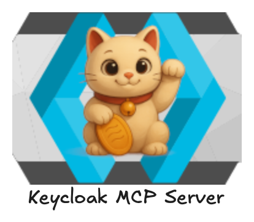
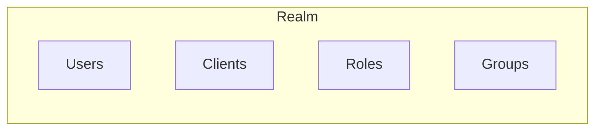

<!-- For a centered logo -->
<p align="center">
  
</p>
<h2 align="center">
  <b> An MCP Server for Keycloak </b>
</h2>

[](https://openjdk.org/projects/jdk/21/)
[](https://gradle.org/)
[](https://gradle.org/)
[](https://deepwiki.com/sshaaf/keycloak-mcp-server)
[](https://github.com/semantic-release/semantic-release)

This project provides tools for developers using Keycloak. It includes utilities for interacting with a Keycloak server, a search client for the official Keycloak Discourse community, and built-in Retrieval-Augmented Generation (RAG) capabilities.

The project is under active development. You can contribute by reporting issues, suggesting new features, or submitting pull requests.

For more details on how to contribute, please see
- [Developers guide](DEVELOPERS.md)
- [Contributors guide](CONTRIBUTORS.md)

## Features

- **MCP Standard**: Implements the Model-Context Protocol for efficient standard input/output server operations.
- **Keycloak Integration**: Seamlessly integrates with Keycloak for authentication and authorization.
- **Discourse Search**: Users can now ask about related issues in Keycloak discourse.
- **Comprehensive API**: Provides tools for managing various Keycloak resources:

- **Quarkus Framework**: Built using Quarkus to provide fast startup times and low memory footprint.

### Releases
The Keycloak MCP server is available in the following formats:
- **Uber JAR**: Available in regular releases and builds
- **Native Binaries**: Available in regular releases and builds for MacOS, Linux, and Windows
- 
## Getting started - configuration

### Cursor
You can add the following in the config in the `~/.cursor/mcp.json`
```yaml
{
  "mcpServers": {
    "keycloak_mcp_server": {
      "type": "stdio",
      "command": "<full path> keycloak-mcp-server-0.1",
      "args": [],
      "env": {
        "KC_URL": "http://localhost:8081",
        "KC_USER": "admin",
        "KC_PASSWORD": "admin"
      }
    }
  }
}

```


You can add the keycloak server by adding the following to `claude_desktop_config`.
### Claude Code
```yaml
{
  "mcpServers": {
    "keycloak": {
      "command": "<full path>/keycloak-mcp-server-0.1",
      "args": [],
      "env": {
        "KC_URL": "http://localhost:8081",
        "KC_USER": "admin",
        "KC_PASSWORD": "admin"
      }
    }
  }
}
```
### VSCode
You can add the keycloak MCP server tools into VS Code by adding the following to your `mcp.json`.

```yaml
  "keycloak_mcp_server": {
    "type": "stdio",
    "command": "<full path> keycloak-mcp-server-0.1",
    "args": [],
    "env": {
      "KC_URL": "http://localhost:8081",
      "KC_USER": "admin",
      "KC_PASSWORD": "admin"
    }
```

### Goose CLI

```yaml
extensions:
  keycloak_mcp_server:
    display_name: Keycloak MCP Server
    enabled: true
    name: keycloak-mcp-server
    timeout: 300
    type: stdio
    cmd: "<full path>keycloak-mcp-server-0.1"
    args: []
    env_keys:
      - "KC_URL"
```
You need to set an environment variable:
e.g.
```bash
export KC_URL=http://localhost:8081
```

Now you can run `goose session` and the extension should be loaded.

### Uber Jar
The examples above are for native binaries. however you can also use the uber-jar
If using the uber jar change the `cmd` and `args` as follows
```yaml
    cmd|command: "java"
    args: ["-jar", "path to jar"]
```


## Example Usage

Here are some examples of how to use the Keycloak MCP Server with Goose:

```
( O)> can I create a new user in keycloak?
Yes, you can create a new user in Keycloak. To do this, you'll need to provide the following information about the user:

- **Realm**: The name of the realm where the user will reside.
- **Username**: The username for the new user.
- **First Name**: The first name of the user.
- **Last Name**: The last name of the user.
- **Email**: The email address of the user.
- **Password**: The password for the user's account.

You can provide these details, and I can assist you with creating the user.


----
( O)> list all users in quarkus realm
Here are the users in the "quarkus" realm:

1. **admin**
   - ID: `af134cab-f41c-4675-b141-205f975db679`

2. **alice**
   - ID: `eb4123a3-b722-4798-9af5-8957f823657a`

3. **jdoe**
   - ID: `1eed6a8e-a853-4597-b4c6-c4c2533546a0`

----
( O)> can you delete user sshaaf from realm quarkus

```

## List of tools (Generated by Goose)
### Realm Management
- **Get a specific realm by name:** Retrieve details about a specific realm.
- **Get all realms from Keycloak:** List all available realms.

### User Management
- **Create a new user in a Keycloak realm:** Add a user with mandatory fields like email, username, etc.
- **Get all users from a Keycloak realm:** List users within a specified realm.
- **Find a user by username in a Keycloak realm:** Search for a user using their username.
- **Add a role to a user in a Keycloak realm:** Assign a role to a user.
- **Remove a role from a user in a Keycloak realm:** Revoke a role from a user.
- **Add a user to a group in a Keycloak realm:** Assign a user to a group.
- **Remove a user from a group in a Keycloak realm:** Remove a user from a group.
- **Find roles assigned to a user in a Keycloak realm:** List roles that are assigned to a specified user.

### Role Management
- **Get all roles from a Keycloak realm:** List all roles available in a realm.
- **Get a specific role from a Keycloak realm:** Retrieve details about a specific role.

### Group Management
- **Get all groups from a Keycloak realm:** List all groups within a specified realm.
- **Get group members from a Keycloak realm:** Retrieve members of a specified group.

### Client Management
- **Create a new client in a Keycloak realm:** Add a client with specified details like clientId and redirect URI.
- **Delete a client in a Keycloak realm:** Remove a specified client.
- **Get a client by its ID in a Keycloak realm:** Retrieve details of a client using its ID.
- **Get all clients from a Keycloak realm:** List all clients within a specified realm.
- **Generate new client secret for a client in a Keycloak realm:** Create a new secret for a specified client.

### Client Role Management
- **Create client role from a Keycloak realm:** Define a role for a client.
- **Delete client role from a Keycloak realm:** Remove a client role.
- **Get client roles in a Keycloak realm:** List roles specific to a client.


## References

- [Keycloak](https://www.keycloak.org/) - Open Source Identity and Access Management
- [Quarkus](https://quarkus.io/) - A Kubernetes Native Java stack
- [Goose by Block](https://github.com/goose-ai/goose) - Command-line interface for AI assistants
- [Model-Context Protocol (MCP)](https://github.com/goose-ai/mcp) - Protocol for efficient standard input/output server operations

## Contributing

Contributions are welcome! For more information please read the following documents. 
- [Developers guide](DEVELOPERS.md)
- [Contributors guide](CONTRIBUTORS.md)
- [Release workflow](RELEASE_WORKFLOW.md)
