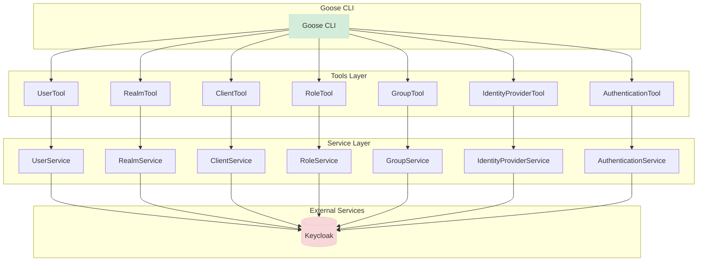

<!-- For a centered logo -->
<p align="center">
  
</p>
<h2 align="center">
  <b> An MCP Server for Keycloak </b>
</h2>

This project is designed to work with Keycloak for identity and access management, providing a robust and scalable solution for managing Keycloak resources through a command-line interface.

## Features

- **MCP Standard**: Implements the Model-Context Protocol for efficient standard input/output server operations.
- **Keycloak Integration**: Seamlessly integrates with Keycloak for authentication and authorization.
- **Comprehensive API**: Provides tools for managing various Keycloak resources:
  - Realms
  - Users
  - Clients
  - Roles
  - Groups
  - Identity Providers
  - Authentication Flows
- **Quarkus Framework**: Built using Quarkus to provide fast startup times and low memory footprint.

## Architecture

The project follows a layered architecture with tool classes that expose functionality through the MCP protocol and service classes that handle the actual operations with Keycloak.

### Class Diagram

Below is a class diagram showing the structure of the tools package and its relationships with the service layer:



### Tools Package Explanation

The tools package contains classes that expose Keycloak functionality through the MCP protocol:

1. **UserTool**: Manages Keycloak users, including creation, deletion, updating user information, and managing user roles and groups.

2. **RealmTool**: Manages Keycloak realms, including creation, deletion, updating realm settings, and managing realm events configuration.

3. **ClientTool**: Manages Keycloak clients, including creation, deletion, updating client settings, managing client secrets, and client roles.

4. **RoleTool**: Manages Keycloak roles, including creation, deletion, updating role settings, and managing role composites.

5. **GroupTool**: Manages Keycloak groups, including creation, deletion, updating group settings, managing group members, and group roles.

6. **IdentityProviderTool**: Manages Keycloak identity providers, including creation, deletion, updating identity provider settings, and managing identity provider mappers.

7. **AuthenticationTool**: Manages Keycloak authentication flows, including creation, deletion, and managing flow executions.

Each tool class follows a similar pattern:
- Injects a corresponding service class that handles the actual operations with Keycloak
- Injects an ObjectMapper for JSON serialization/deserialization
- Exposes methods with @Tool annotations that delegate to the service class
- Handles exceptions and provides meaningful error messages

## Prerequisites

- **Java 21 or newer**: Ensure you have Java installed on your system.
- **Gradle**: Required for building and running the project.
- **Docker**: Required for running a local Keycloak instance (optional).

## Getting Started

### Starting a Local Keycloak Instance

You can start a local Keycloak instance using Docker Compose:

```bash
docker-compose -f deploy/docker-compose.yml up
```

### Building the Application

To build the application using Gradle:

```bash
./gradlew build
```

To build an uber jar:

```bash
./gradlew quarkusBuild -Dquarkus.package.type=uber-jar
```

### Running with Goose

[Goose](https://github.com/goose-ai/goose) is a command-line interface for AI assistants. You can integrate and run this project as an extension with Goose:

```bash
goose session --with-extension="java -jar build/quarkus-app/quarkus-run.jar"
```

Or with the uber jar:

```bash
goose session --with-extension="java -jar build/keycloak-mcp-server-1.0.0-Alpha1-runner.jar"
```

## Example Usage

Here are some examples of how to use the Keycloak MCP Server with Goose:

```
( O)> can I create a new user in keycloak?
Yes, you can create a new user in Keycloak. To do this, you'll need to provide the following information about the user:

- **Realm**: The name of the realm where the user will reside.
- **Username**: The username for the new user.
- **First Name**: The first name of the user.
- **Last Name**: The last name of the user.
- **Email**: The email address of the user.
- **Password**: The password for the user's account.

You can provide these details, and I can assist you with creating the user.


----
( O)> list all users in quarkus realm
Here are the users in the "quarkus" realm:

1. **admin**
   - ID: `af134cab-f41c-4675-b141-205f975db679`

2. **alice**
   - ID: `eb4123a3-b722-4798-9af5-8957f823657a`

3. **jdoe**
   - ID: `1eed6a8e-a853-4597-b4c6-c4c2533546a0`

----
( O)> can you delete user sshaaf from realm quarkus

```

## References

- [Keycloak](https://www.keycloak.org/) - Open Source Identity and Access Management
- [Quarkus](https://quarkus.io/) - A Kubernetes Native Java stack
- [Goose by Block](https://github.com/goose-ai/goose) - Command-line interface for AI assistants
- [Model-Context Protocol (MCP)](https://github.com/goose-ai/mcp) - Protocol for efficient standard input/output server operations

## Contributing

Contributions are welcome! Please feel free to submit a Pull Request.

## License

This project is licensed under the Apache License 2.0 - see the LICENSE file for details.