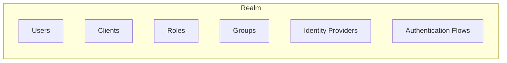

<!-- For a centered logo -->
<p align="center">
  
</p>
<h2 align="center">
  <b> An MCP Server for Keycloak </b>
</h2>

[](https://openjdk.org/projects/jdk/21/)
[](https://gradle.org/)
[](https://gradle.org/)

This project is designed to work with Keycloak for identity and access management, providing a robust and scalable solution for managing Keycloak resources through a command-line interface.

### Releases
The Keycloak MCP server is available in the following formats:
- **Uber JAR**: Available in regular releases and builds
- **Native Binaries**: Available through nightly builds for MacOS, Linux, and Windows

## Features

- **MCP Standard**: Implements the Model-Context Protocol for efficient standard input/output server operations.
- **Keycloak Integration**: Seamlessly integrates with Keycloak for authentication and authorization.
- **Comprehensive API**: Provides tools for managing various Keycloak resources:

- **Quarkus Framework**: Built using Quarkus to provide fast startup times and low memory footprint.

## Getting started - configuration

### Cursor
You can add the following in the config in the `~/.cursor/mcp.json`
```yaml
{
  "mcpServers": {
    "keycloak_mcp_server": {
      "type": "stdio",
      "command": "<full path> keycloak-mcp-server-0.1",
      "args": [],
      "env": {
        "KC_URL": "http://localhost:8081",
        "KC_USER": "admin",
        "KC_PASSWORD": "admin"
      }
    }
  }
}

```


You can add the keycloak server by adding the following to `claude_desktop_config`.
### Claude Code
```yaml
{
  "mcpServers": {
    "keycloak": {
      "command": "<full path>/keycloak-mcp-server-0.1",
      "args": [],
      "env": {
        "KC_URL": "http://localhost:8081",
        "KC_USER": "admin",
        "KC_PASSWORD": "admin"
      }
    }
  }
}
```
### VSCode
You can add the keycloak MCP server tools into VS Code by adding the following to your `mcp.json`.

```yaml
  "keycloak_mcp_server": {
    "type": "stdio",
    "command": "<full path> keycloak-mcp-server-0.1",
    "args": [],
    "env": {
      "KC_URL": "http://localhost:8081",
      "KC_USER": "admin",
      "KC_PASSWORD": "admin"
    }
```

### Goose CLI

```yaml
extensions:
  keycloak_mcp_server:
    display_name: Keycloak MCP Server
    enabled: true
    name: keycloak-mcp-server
    timeout: 300
    type: stdio
    cmd: "<full path>keycloak-mcp-server-0.1"
    args: []
    env_keys:
      - "KC_URL"
```
You need to set an environment variable:
e.g.
```bash
export KC_URL=http://localhost:8081
```

Now you can run `goose session` and the extension should be loaded.

### Uber Jar
The examples below are for native binaries. however you can also use the uber-jar
If using the uber jar change the `cmd` and `args` as follows
```yaml
    cmd|command: "java"
    args: ["-jar", "path to jar"]
```


## Example Usage

Here are some examples of how to use the Keycloak MCP Server with Goose:

```
( O)> can I create a new user in keycloak?
Yes, you can create a new user in Keycloak. To do this, you'll need to provide the following information about the user:

- **Realm**: The name of the realm where the user will reside.
- **Username**: The username for the new user.
- **First Name**: The first name of the user.
- **Last Name**: The last name of the user.
- **Email**: The email address of the user.
- **Password**: The password for the user's account.

You can provide these details, and I can assist you with creating the user.


----
( O)> list all users in quarkus realm
Here are the users in the "quarkus" realm:

1. **admin**
   - ID: `af134cab-f41c-4675-b141-205f975db679`

2. **alice**
   - ID: `eb4123a3-b722-4798-9af5-8957f823657a`

3. **jdoe**
   - ID: `1eed6a8e-a853-4597-b4c6-c4c2533546a0`

----
( O)> can you delete user sshaaf from realm quarkus

```

### Accessing Build Artifacts

#### Regular Builds
Regular builds produce only the JVM artifacts (JAR and Uber JAR). These are available:
- As GitHub release assets for official releases
- As build artifacts in GitHub Actions for all builds

#### Nightly Native Builds
Native binaries are built nightly and are available:
- As GitHub pre-releases tagged with `nightly-YYYY-MM-DD`
- As build artifacts in the GitHub Actions "Nightly Native Build" workflow

You can also manually trigger a native build using the "Run workflow" button on the "Nightly Native Build" workflow page in GitHub Actions.


## References

- [Keycloak](https://www.keycloak.org/) - Open Source Identity and Access Management
- [Quarkus](https://quarkus.io/) - A Kubernetes Native Java stack
- [Goose by Block](https://github.com/goose-ai/goose) - Command-line interface for AI assistants
- [Model-Context Protocol (MCP)](https://github.com/goose-ai/mcp) - Protocol for efficient standard input/output server operations

## Contributing

Contributions are welcome! Please feel free to submit a Pull Request.
